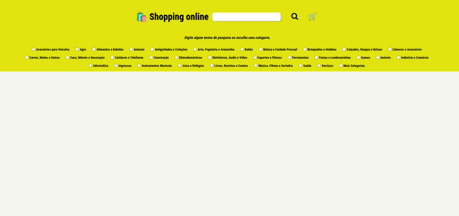

# 🛍️ 🛒 Shopping Online

  

 

## :memo: Descrição

 Este é um projeto de um aplicativo web de compras online, desenvolvido utilizando a biblioteca React. O aplicativo permite pesquisar e visualizar produtos, adicionar itens ao carrinho de compras e remover itens do carrinho.

 
##  💻 Execução
- Certifique-se de ter o Node.js instalado em seu sistema.
- Faça o clone deste repositório para o seu ambiente local.
- Navegue até o diretório raiz do projeto.
- Execute o comando npm install para instalar as dependências do projeto.
- Execute o comando npm start para iniciar o servidor de desenvolvimento.

## ⚙️ Funcionalidades
- Pesquisa de produtos por nome ou categoria.
- Exibição de produtos com nome, imagem e preço.
- Adição de produtos ao carrinho de compras.
- Remoção de produtos do carrinho de compras.
- Contagem de quantidade de itens no carrinho.
- Navegação entre páginas usando React Router.

## :wrench: Tecnologias utilizadas

- React.js
- JavaScript
- HTML
- CSS

## 🤝 Contribuintes

 Este projeto foi desenvolvido em grupo durante o curso de Desenvolvimento Web Full Stack na escola de tecnologia Trybe.

- Letícia Augusta - [GitHub](https://github.com/Hey-Lets-code)
- BenHur Albertassi - [GitHub](https://github.com/BenHurAlbertassi12)
- Chrystian Lunetta - [GitHub](https://github.com/iacedrone)

